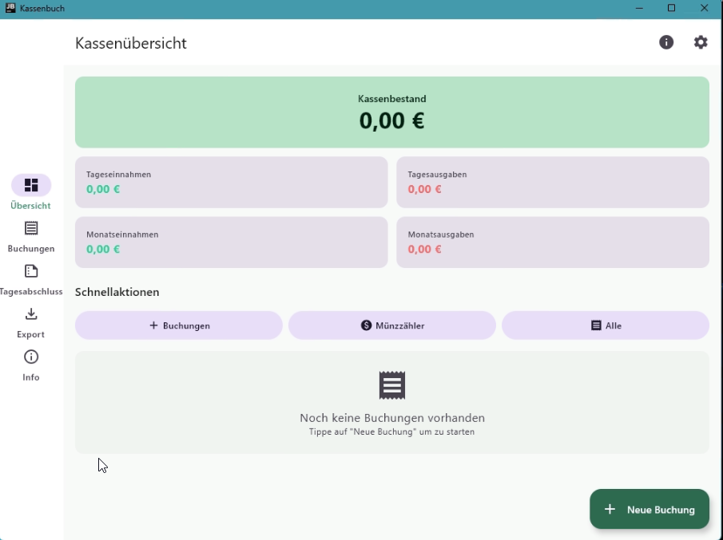
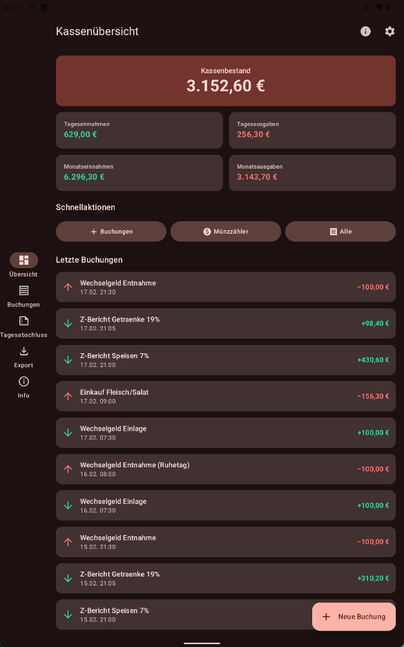
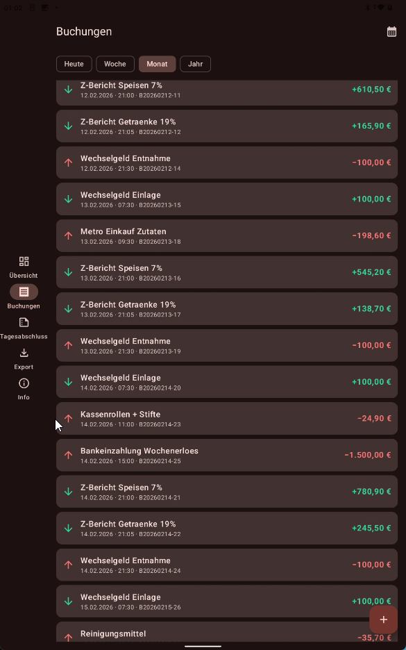
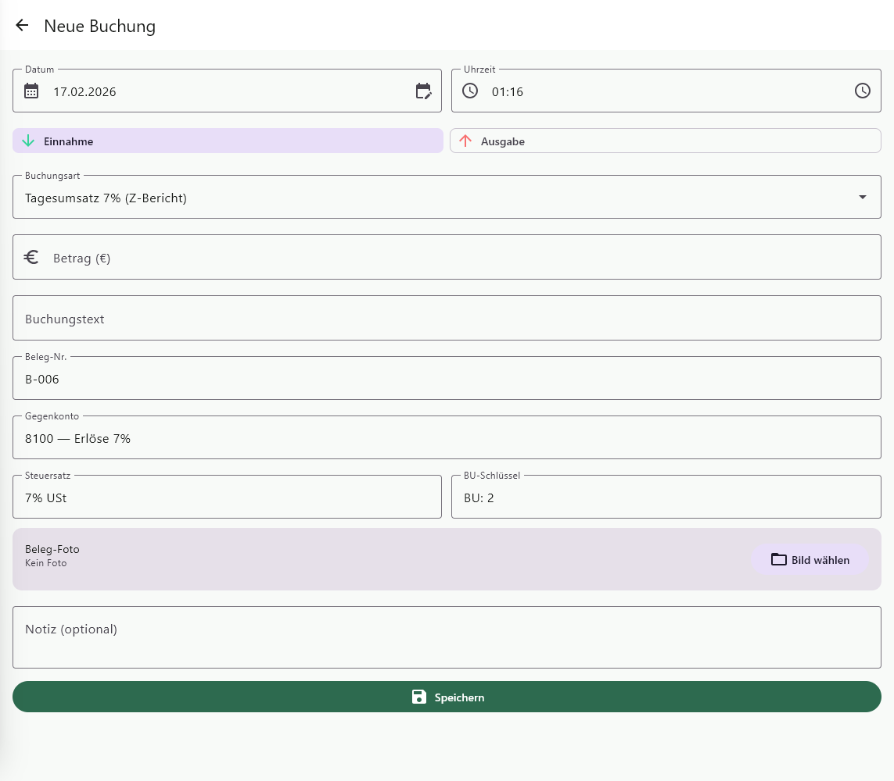
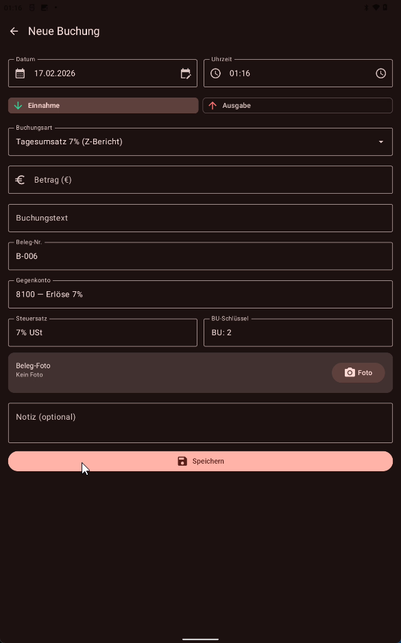
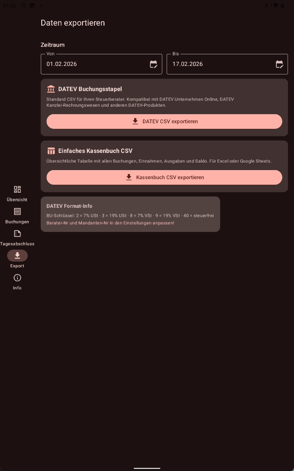
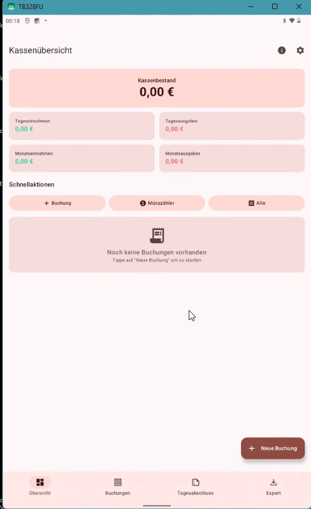

# Kassenbuch - Küçük İşletmeler için KMP Uygulaması

> Dönerci, pizzacı ve küçük gastronomi işletmeleri için dijital kasa defteri.
> Almanya GoBD kurallarına uygun · DATEV dışa aktarımı · Material 3 · Offline · Android, Desktop & iOS

---

## Bu nedir?

Almanya'daki GoBD kurallarına uygun dijital kasa defteri uygulaması. Kotlin Multiplatform (KMP) ve Compose Multiplatform ile yazılmış olup Android, Windows, macOS, Linux ve iOS üzerinde çalışır. Özellikle dönerci, pizzacı gibi küçük gastronomi işletmeleri için geliştirilmiştir.

---

## Ekran Görüntüleri

### Dashboard

| Desktop (Aydınlık) | Android Tablet (Karanlık) |
|:--:|:--:|
|  |  |

### Kayıtlar & Yeni Kayıt

| Android Kayıt Listesi (Aylık Filtre) | Desktop Kayıt Formu | Android Kayıt Formu |
|:--:|:--:|:--:|
|  |  |  |

### Dışa Aktarım & Android (Compact)

| Android Export | Android (Compact) |
|:--:|:--:|
|  |  |

---

## Özellikler

| Özellik | Açıklama |
|---------|----------|
| **Dashboard** | Kasa bakiyesi, günlük/aylık gelir-gider özeti |
| **Buchung (Kayıt)** | Tarih, saat, tutar, kayıt türü, karşı hesap ile gelir-gider kaydı |
| **Beleg-Foto (Fiş Fotoğrafı)** | Fişleri kamerayla çekip kayda ekleme |
| **Münzzähler (Para Sayıcı)** | Kasadaki parayı madeni para ve banknot olarak sayma |
| **Tagesabschluss (Gün Sonu)** | Devir, gelir, gider, kasa farkı hesaplama |
| **Zeitraum-Filter** | Günlük, haftalık, aylık ve yıllık filtreleme |
| **DATEV Export** | Muhasebeciye gönderilebilir DATEV CSV formatı (EXTF v12.0) |
| **CSV Export** | Excel/Sheets için basit tablo |
| **Datenbank Backup** | Veritabanını ZIP olarak yedekleme ve geri yükleme |
| **Einstellungen (Ayarlar)** | İşletme bilgileri, DATEV numaraları, para üstü ayarı |
| **Karanlık/Aydınlık Tema** | Material 3, otomatik karanlık mod |
| **Duyarlı Tasarım** | Telefonda alt menü, tablette/masaüstünde yan menü |
| **Çok Dilli Kılavuz** | Türkçe ve Almanca seçmeli kullanım kılavuzu |

---

## Kullanım Kılavuzu

### Genel Bakış (Dashboard)

Uygulama açıldığında **Dashboard** gösterilir. Burada şunlar görüntülenir:

- **Kassenbestand (Kasa Bakiyesi)**: Tüm kayıtlardan hesaplanan mevcut nakit bakiye.
- **Tageseinnahmen / Tagesausgaben (Günlük Gelir/Gider)**: Bugünkü toplam gelir ve gider.
- **Monatseinnahmen / Monatsausgaben (Aylık Gelir/Gider)**: Bu ayki toplam gelir ve gider.
- **Letzte Buchungen (Son Kayıtlar)**: Son eklenen kayıtların hızlı görünümü.

**Schnellaktionen (Hızlı İşlemler)** ile doğrudan yeni kayıt oluşturabilir, para sayıcıya geçebilir veya tüm kayıtları görüntüleyebilirsiniz.

**Dikkat edilmesi gerekenler:**
- Gösterilen kasa bakiyesi her zaman kasadaki gerçek nakit ile eşleşmelidir.
- Dashboard yalnızca bir özet gösterir. Detaylı günlük bakış için **Tagesabschluss** sekmesini kullanın.

---

### Buchungen (Kayıtlar)

**Buchungen** sekmesinde seçilen günün tüm gelir ve giderleri listelenir. Takvim simgesiyle başka bir gün seçilebilir. Filtre çipleriyle günlük, haftalık, aylık veya yıllık görünüme geçilebilir.

**Yeni kayıt oluşturma:**
1. **+** butonuna dokunun.
2. **Tarih ve saat** otomatik olarak güncel zamana ayarlanır, istenirse değiştirilebilir.
3. **Einnahme (Gelir)** veya **Ausgabe (Gider)** seçin. Kayıt türleri otomatik olarak değişir.
4. Uygun **kayıt türünü** seçin (örn. "Tagesumsatz 7%", "Wareneinkauf 19%"). Gegenkonto, BU-Schlüssel ve vergi oranı SKR03'e göre otomatik doldurulur.
5. **Tutarı** Euro olarak girin (KDV dahil brüt tutar).
6. **Kayıt metni** girin (örn. "Z-Bericht Speisen", "Netto Einkauf").
7. İsteğe bağlı: **Beleg-Nr.** otomatik olarak verilir.
8. İsteğe bağlı: **Fiş fotoğrafı** çekin.
9. İsteğe bağlı: **Not** ekleyin.
10. **Speichern (Kaydet)** ile tamamlayın.

**Dikkat edilmesi gerekenler:**
- Tutar her zaman **brüt tutardır** (KDV dahil). Net/vergi ayrımı DATEV exportunda otomatik yapılır.
- Her işlem tek tek ve zamanında kaydedilmelidir (GoBD zorunluluğu).
- Z-Bericht'teki **BAR satış tutarını** kaydedin (7% ve 19% ayrı ayrı).
- Fişleri her zaman saklayın — uygulamada fotoğraf olarak veya dosya halinde.

---

### Tagesabschluss (Gün Sonu Kapanışı)

**Tagesabschluss** sekmesinde günlük kasa kapanışı yapılır:

- **Vortrag (Devir)**: Önceki günden kalan bakiye.
- **Einnahmen (Gelirler)**: Günün tüm gelirleri.
- **Ausgaben (Giderler)**: Günün tüm giderleri.
- **Endbestand (Son Bakiye)**: Hesaplanan kasa bakiyesi (Devir + Gelir − Gider).

**Kassensturz (Kasa Sayımı):**
1. Kasadaki nakit parayı sayın. Bunun için dahili **Münzzähler (Para Sayıcı)** kullanılabilir.
2. **Gezählter Bestand (Sayılan Tutar)** alanına girin.
3. Uygulama otomatik olarak **farkı** gösterir.
4. **Tagesabschluss durchführen** ile günü kapatın.

**Dikkat edilmesi gerekenler:**
- Gün sonu kapanışı her akşam iş bitiminde yapılmalıdır.
- Birkaç sentlik fark normal olabilir (yuvarlama farkları).
- 5 €'dan fazla fark eksik veya yanlış kayıtlara işaret eder.
- Kapatılan gün yeşil onay ile işaretlenir.
- Filtre çipleriyle haftalık, aylık veya yıllık özet görüntülenebilir.

---

### Export (Dışa Aktarım)

**Export** sekmesinde kayıtlar muhasebeci için dışa aktarılır:

**DATEV Export (EXTF v12.0):**
- Muhasebecinin DATEV'e doğrudan aktarabileceği resmi CSV formatı.
- İçerir: Umsatz, Soll/Haben, Konto, Gegenkonto, BU-Schlüssel, Belegdatum, Buchungstext, Belegfeld.

**Basit CSV Export:**
- Tarih, saat, kayıt türü, tutar, metin ve beleg numarasıyla düzenli tablo.
- Excel, Google Sheets veya herhangi bir tablolama programında açılabilir.

**Nasıl yapılır:**
1. **Zeitraum (Dönem)** — Von/Bis tarihlerini belirleyin.
2. **DATEV exportieren** veya **CSV exportieren** butonuna dokunun.
3. Export başarılıysa dosya adıyla onay gösterilir.
4. **Teilen (Paylaş)** butonu ile doğrudan e-posta veya bulut ile gönderin.

**Dikkat edilmesi gerekenler:**
- İlk DATEV exportundan önce **Einstellungen'de** Berater-Nr. ve Mandanten-Nr. girilmelidir. Bu numaraları muhasebeciden alın.
- Export genellikle **aylık** olarak ay sonunda yapılmalıdır.

---

### Datenbank (Veritabanı Yönetimi)

**Datenbank** sekmesinden veritabanı yedekleme ve geri yükleme yapılabilir:

- **Backup erstellen**: Mevcut veritabanını ZIP dosyası olarak yedekler.
- **Wiederherstellen**: Seçilen ZIP dosyasından veritabanını geri yükler.
- Yedekler `logs/kassenbuch/backup/` klasöründe `kassenbuch_YYYY_MM_DD_HH_mm.zip` formatında saklanır.

**Dikkat:** Geri yükleme sonrasında uygulama yeniden başlatılmalıdır!

---

## Günlük Kullanım Akışı

```
Sabah:  Wechselgeld Einlage (100 €) → Buchung ekle
Gün:    Satış yap, gerekirse Netto'dan alışveriş kaydet
Akşam:  Z-Bericht kes → BAR satışı kaydet (7%/19% ayrı)
        → Wechselgeld Entnahme → Tagesabschluss
Haftalık: Bankaya nakit yatır → Bankeinzahlung kaydet
Ay Sonu: DATEV Export → Muhasebecine gönder
```

---

## Teknik Mimari

### Platformlar

| Platform | Durum |
|----------|-------|
| Android | Destekleniyor (Min SDK 30) |
| Windows / macOS / Linux | Destekleniyor (JVM Desktop) |
| iOS (iPad) | Hazırlanıyor (Compile Target) |

### Teknoloji Yığını

| Katman | Teknoloji |
|--------|-----------|
| **Dil** | Kotlin 2.2 · Kotlin Multiplatform |
| **UI** | Compose Multiplatform · Material 3 |
| **Navigasyon** | Compose Navigation (KMP) · Type-Safe Routes |
| **Veritabanı** | SQLDelight (Multiplatform SQLite) |
| **DI** | Koin (Multiplatform) |
| **Asenkron** | Kotlin Coroutines + Flow |
| **ViewModel** | Jetpack Lifecycle ViewModel (KMP) |
| **Kamera** | CameraX (Android) |
| **Loglama** | Kermit (Multiplatform) |
| **Görseller** | Coil 3 (Multiplatform) |
| **Ayarlar** | Multiplatform Settings |
| **Serileştirme** | kotlinx.serialization |

### Proje Yapısı

```
composeApp/src/
├── commonMain/kotlin/de/panda/kassenbuch/
│   ├── App.kt                        # NavHost + HomeContent (Sekmeler)
│   ├── navigation/Routes.kt          # @Serializable Route tanımları
│   ├── data/
│   │   ├── entity/                    # Buchung, Tagesabschluss, BuchungsArt
│   │   ├── db/                        # SQLDelight tarafından oluşturulan DB
│   │   └── repository/                # KassenbuchRepository
│   ├── di/CommonModule.kt             # Ortak Koin modülü
│   ├── ui/
│   │   ├── theme/                     # Material 3 Tema (Karanlık/Aydınlık)
│   │   ├── components/                # AdaptiveLayout, WindowSizeClass, StatusPopup
│   │   └── screens/
│   │       ├── dashboard/             # Dashboard + ScreenModel
│   │       ├── booking/               # Kayıt formu + liste
│   │       ├── daily/                 # Tagesabschluss + Münzzähler
│   │       ├── export/                # DATEV + CSV Export
│   │       ├── database/              # Veritabanı yedekleme/geri yükleme
│   │       ├── settings/              # Einstellungen (Ayarlar)
│   │       └── info/                  # Platforma özel bilgi
│   ├── platform/                      # expect tanımları
│   └── util/                          # Formatter, DatevExporter, PrefsManager, SeedData
├── androidMain/                       # Android'e özel (Activity, Kamera, SQLite sürücüsü)
├── desktopMain/                       # Desktop'a özel (JVM Pencere, SQLite sürücüsü)
└── iosMain/                           # iOS'a özel (UIViewController, SQLite sürücüsü)
```

### SKR03 Hesap Kodları

| Hesap | Adı | Kullanım |
|-------|-----|----------|
| 1000 | Kasse | Ana kasa hesabı |
| 1200 | Bank | Banka hesabı |
| 1360 | Geldtransit | Kasa-Banka transferi |
| 1590 | Durchl. Posten | Gutschein satışı (0%) |
| 1800 | Privatentnahme | Wechselgeld çıkarma |
| 1890 | Privateinlage | Wechselgeld koyma |
| 3300 | Wareneingang 7% | Gıda alışverişi |
| 3400 | Wareneingang 19% | İçecek, ambalaj |
| 4930 | Bürobedarf | Ofis malzemesi |
| 4980 | Sonstige Kosten | Diğer giderler |
| 8100 | Erlöse 7% | Yemek satışı |
| 8300 | Erlöse 19% | İçecek satışı |

### BU-Schlüssel (DATEV)

| Kod | Anlamı |
|-----|--------|
| 2 | %7 KDV (Umsatzsteuer) |
| 3 | %19 KDV (Umsatzsteuer) |
| 8 | %7 Ön KDV (Vorsteuer) |
| 9 | %19 Ön KDV (Vorsteuer) |
| 40 | KDV'siz (Steuerfrei) |

---

## Derleme ve Çalıştırma

```bash
# Desktop'u başlat
./gradlew :composeApp:run

# Android derle
./gradlew :composeApp:compileDebugKotlinAndroid

# Desktop dağıtım paketi oluştur
./gradlew :composeApp:packageMsi        # Windows
./gradlew :composeApp:packageDmg        # macOS
./gradlew :composeApp:packageDeb        # Linux
```

| Özellik | Değer |
|---------|-------|
| Kotlin | 2.2.20 |
| Compose Multiplatform | 1.10.1 |
| Min SDK (Android) | 30 (Android 11) |
| Target SDK (Android) | 35 (Android 15) |
| JVM Target | 21 |

---

## Notlar

- **Bu bir vergi danışmanlığı değildir.** Tüm ayarları ve dışa aktarımları muhasebecine danışarak kullanın.
- DATEV Export'taki Berater-Nr. ve Mandanten-Nr. bilgilerini mutlaka muhasebecinden alın.
- Z-Berichte ve tüm belgeler 10 yıl saklanmalıdır (§ 147 AO).
- Uygulama tamamen offline çalışır — internet gerektirmez.

---

## Lisans

Bu proje [MIT Lisansı](LICENSE) ile lisanslanmıştır.
